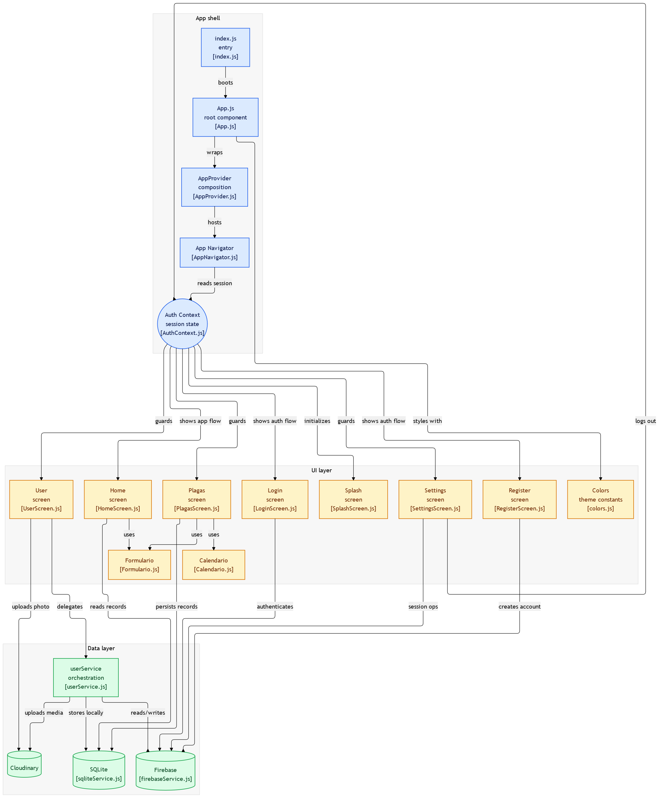

# descripcion

es una aplicación móvil integral diseñada para empresas y profesionales del control de plagas. Soluciona la dispersión de la información al centralizar en un solo lugar la agenda de servicios de fumigación y una completa base de conocimiento sobre plagas. Nuestro valor añadido es doble: para el técnico, una herramienta de gestión diaria que evita errores de calendario; para la empresa y sus clientes, una fuente de información educativa que justifica los tratamientos, fideliza y reduce las reincidencias.

# Capturas

en esta imagen es el registro de la aplicacion en el cual pide el nombre, correo, contraseña y confirmar contraseña, esa funcion esta en la carpeta de auth y ahi esta el archivo js del registro

-----

al registrarse se lleva a la pagina en el apartado principal en el cual es home, el archivo en el cual esta la info que es home esta en la carpeta de screens

-----

al agregar una orden se guarda la orden en el sqlite

-----

se puede mirar la orden que se guardo

-----

esta la funcion de registrar los tipos de plagas que existen

-----

esta la funcion de agregar foto de perfil

-----

en el apartado de ajustes esta el boton de cerrar sesion en el cual el archivo que hae que cumpla la funcion para que el usuario pueda cerrar la sesion en la aplicacion esta en la carpeta de screen

-----

al cerrar sesion la aplicacion la lleva al login para que el usuario pueda iniciar sesion con la cuenta que se creo

-----

## diagrama 

